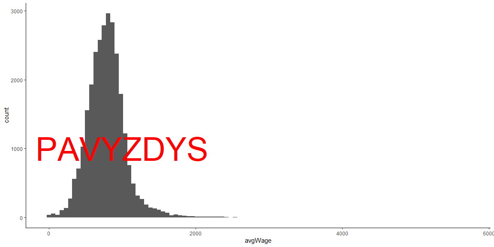
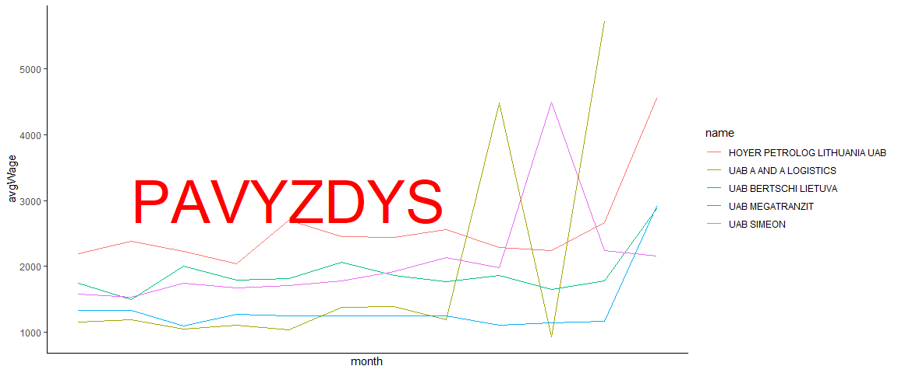
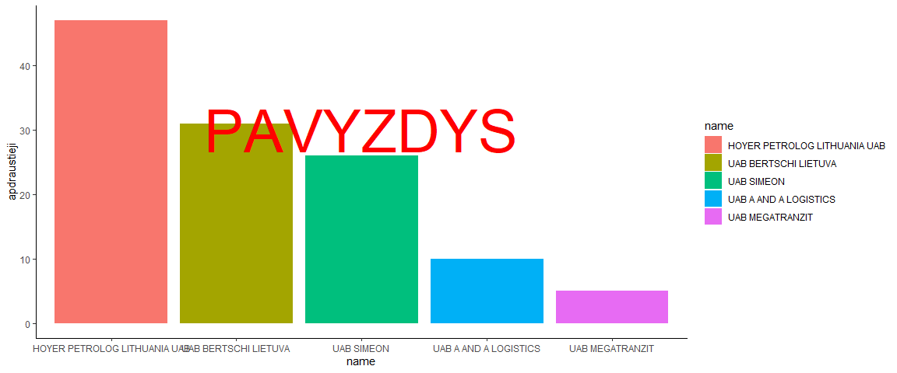
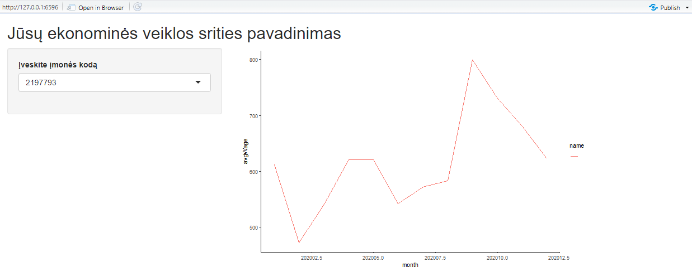

# R Laboratorinis darbas: duomenų vizualizacija 2

## Laboratorinio darbo vertinimas

*	Duomenų importavimas ir paruošimas (2 taškai)
*	Duomenų vizualizacija (plot, geom_point, geom_bar) (3 taškai)
*	R Shiny aplikacija (2 taškai)
*	R Shiny aplikacijos veikimas dėstytojo kompiuteryje (1 taškas)
*	Repositorija atitinka nurodytus reikalavimus (2 taškai)

+1 papildomas taškas prie laboratorinio darbo įvertinimo pridedamas už išvadų pateikimą ir/arba savo dizainu/funkcionalumu išsiskiriančią R Shiny aplikaciją.

## Reikalavimai atsiskaitymui

*	sukurta github repositorija (fork iš https://github.com/kestutisd/KTU-P160B131-2024-lab)
*	R skriptas duomenų apdorojimui (R/1-data_prep.R)
*	R skriptas duomenų vizualizacijai (R/2-visualization.R)
*	grafikų patalpinimas img kataloge
*	R Shiny aplikacija "app" kataloge (gali buti 1 (app.R) arba 2 (ui.R ir server.R) failai)
*	Analizės išvados (jeigu yra) pateikiamos laboratorinis/readme.md faile

Papildomą R programos kodą (jeigu yra) galite kelti į R katalogą. Repositorijoje venkite šiukšlių bei **didelės apimties** failų.

## Laboratorinio darbo užduotys

Įsitikinkite, jog:
* turite github.com paskyrą
* esate instaliavę git klientą https://git-scm.com/downloads
* turite RStudio ir R su visais reikalingais paketais (pvz. tidyverse, shiny)

Prisijunkite prie savo github.com paskyros. Atlikite "fork" veiksmą iš projekto šablono repozitorijos: https://github.com/kestutisd/KTU-P160B131-2024-lab

Atsisiųskite naujai sukurtą repozitoriją į savo kompiuterį (git clone) ir pradėkite dirbti projekto direktorijoje.

### 1. Užduotis

Duomenų paruošimas:

* Atsisiųskite nurodytus duomenis (programatiškai)
* Išarchyvuokite
* Nuskaitykite duomenų failą
* Atlikite savo variantui priskirtą filtravimą pagal veiklos sritį
* Išsaugokite išfiltruotus duomenis **data** kataloge (formatą galite naudoti kokį norite)
* Įsitikinkite, jog nėra laikinų failų (pvz. zip)
* Išsaugokite duomenų apdorovimo failą (R/1-data_prep.R)

### 2.1 Užduotis

Nuskaitę paruoštą failą **data** kataloge, nubrėžkite histogramą vidutiniam atlyginimui. Galite naudoti base funkciją arba ggplot.

### 2.2 Užduotis

Išrinkite 5 įmones, kurių faktinis sumokėtas darbo užmokestis per metus buvo didžiausias. Atvaizduokite šių įmoniu˛ vidutinio atlyginimo kitimo dinamiką metų eigoje.

### 2.3 Užduotis

Iš 2.2 užduotyje išrinktų 5 įmonių išrinkite maksimalų apdraustų darbuotojų skaičių. Atvaizduokite stulpeline diagrama mažėjimo tvarka.

### 3. Užduotis

Sukurkite web aplikaciją pagal nurodytą veiklos sritį. Naudokite išfiltruotus duomenis (duomenų paruošimo žingsnyje). Aplikacijos tikslas - dinamiškai vizualizuoti atlyginimų dinamiką (plotOutput), pasirinkus įmonę (pvz. pasirenkant iš įmonių sąrašo arba įvedus įmonės kodą)

Shiny R aplikacijos nuotrauka:

### Darbo pateikimas

Išsaugokite sugeneruotus paveikslėlius ir shiny aplikacijos nuotrauką (screenshot) į "img" katalogą. Įsitikinkite, jog pagrindiniame README.md referuojate į savuosius paveikslėlius. 

Įkelkite lokaliai atliktus kodo pakeitimus į savo github repozitoriją (git add; git commit -m; git push).

# Laboratorinio darbo variantai

Laboratoriniame darbe kiekvienam studentui yra atsitiktiniu budu priskirtas ekonominės veiklos kodas bei skirtingas failo tipas, pagal kurį reikės paruošti duomenis.

|Variantas | ecoActCode|Formatas          |
|:---------|----------:|:-----------------|
|1         |     949900|monthly-2023.json |
|2         |     494100|monthly-2023.json |
|3         |     682000|monthly-2023.json |
|4         |     412000|monthly-2023.json |
|5         |     452000|monthly-2023.json |
|6         |     702200|monthly-2023.json |
|7         |     561000|monthly-2023.csv  |
|8         |     692000|monthly-2023.json |
|9         |     451100|monthly-2023.csv  |
|10        |     479100|monthly-2023.json |
|11        |     681000|monthly-2023.csv  |
|12        |     862300|monthly-2023.json |
|13        |     522920|monthly-2023.json |
|14        |     471100|monthly-2023.csv  |
|15        |     467300|monthly-2023.csv  |
|16        |     620000|monthly-2023.json |
|17        |     461000|monthly-2023.json |
|18        |     460000|monthly-2023.csv  |
|19        |     620100|monthly-2023.csv  |
|20        |     680000|monthly-2023.json |
|21        |     560000|monthly-2023.json |
|22        |     471900|monthly-2023.json |
|23        |     433900|monthly-2023.csv  |

Duomenų failai: 

* https://atvira.sodra.lt/imones/downloads/2023/monthly-2023.json.zip
* https://atvira.sodra.lt/imones/downloads/2023/monthly-2023.csv.zip
